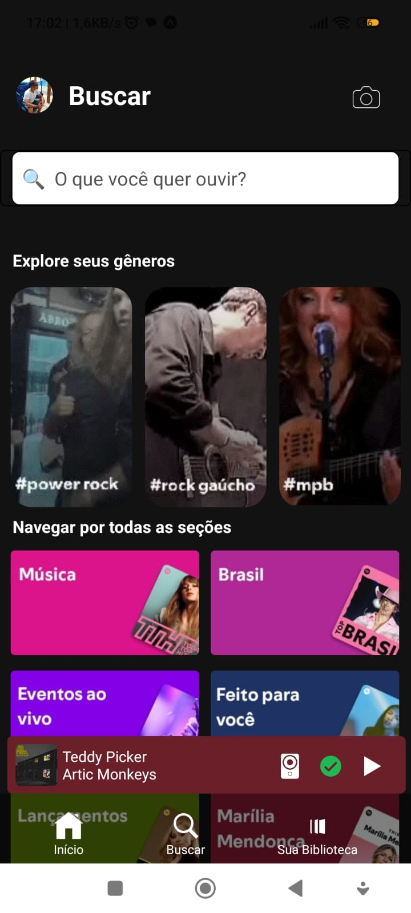

# Spotify Clone

Este projeto é um clone de duas telas do aplicativo Spotify, criado com **React Native** usando **TypeScript** para reproduzir a interface visual do aplicativo.

## Objetivo

O objetivo deste projeto é clonar duas telas do aplicativo Spotify, mantendo o layout e o estilo visual o mais próximo possível do original.

## Tecnologias e Ferramentas

- **React Native**: Framework para desenvolvimento de aplicativos móveis.
- **TypeScript**: Para tipagem estática e maior robustez no código.
- **Git**: Controle de versão para gerenciar o desenvolvimento do projeto.
- **Visual Studio Code (VSCode)**: Editor de código utilizado no desenvolvimento do projeto.
- **GIMP**: Ferramenta de edição de imagens usada para ajustar e preparar os recursos visuais do aplicativo.
- **Clipchamp**: Ferramenta de edição de vídeo utilizada para criar e editar a visualização e outros conteúdos relacionados.

## Componentes

- **Imagem do Perfil**: Mostra a imagem de perfil do usuário.
- **Campo de Busca**: Permite a busca de músicas.
- **Ícones de Navegação**: Inclui "Início", "Buscar" e "Biblioteca".
- **Barra de Música**: Exibe a música em reprodução na parte inferior.
- **Cartões e Estações de Música**: Exibe playlists, estações e recomendações de músicas.

## Funcionalidades

- Clonagem do layout e estilo visual das telas do Spotify.
- Barra de navegação com ícones de navegação padrão do Spotify.
- Barra de reprodução de música fixa na parte inferior.
- Scrolling horizontal para as listas de estações e playlists.
- Estilo responsivo e adaptável.

## Telas Clonadas

### Parte 1

| Tela Original 1                                | Tela Clone 1                                |
|------------------------------------------------|---------------------------------------------|
|  |  |

---

### Parte 2

| Tela Original 2                                | Tela Clone 2                                |
|------------------------------------------------|---------------------------------------------|
|  |  |
## Como Executar o Projeto

1. Clone o repositório:
   ```bash
   [git clone https://github.com/ViniciusCassiano2105/React-Native]
   ```
2. Instale as dependências:
   ```bash
   npm install
   ```
3. Execute o Projeto:
   ```bash
   npm start
   ```
